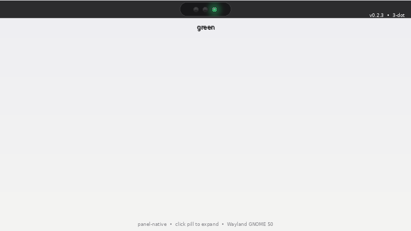

# opencode-status-pill — panel-native

> **npm: `opencode-status-pill`** — `traffic-light` bin alias preserved.

**3-dot pill** — sleek **dark pill** in the **GNOME top bar** with 3 luminous lenses (real traffic-light housing):

- 🟢 **green** `#2ecc71` — idle / finished
- 🟡 **yellow** `#ffcc00` — working (tool running, streaming)
- 🔴 **red** `#ff453a` — needs you (permission / question asked)
- 🟣 **magenta** `#bf5af2` — error (reuses red lens with magenta glow + `error-pulse`, sticky until new session)

Dark pill `rgba(18,18,20,0.88)` with 11px dots, one glows luminous at a time (dim others 0.38), `error` shows as magenta in the red position so 3 lenses stay pure. Popup still shows per-session rows (8px dots + cwd/reason/elapsed). Pill lives *inside the panel* (`panel-button.traffic-light` transparent, `blur-my-shell` `#panel.transparent-panel` blur shows through) — no floating window, perfect on GNOME 50 Wayland + WhiteSur.

Click the pill to expand per-session rows: cwd, reason, elapsed (`2m14s`), stale dim. Click a row to **focus its terminal** (best-effort via `Meta.Window` → `/proc/<pid>/cwd` match) and copy `cwd` to clipboard.



## How it works

```
opencode TUI(s) ──events──▶ traffic-light.js (plugin, :4390) ──HTTP──▶ GNOME Shell extension
```

 1. **`traffic-light.js`** — opencode plugin (Bun). Listens to structured events (`permission.asked/v2.asked`, `question.asked/v2.asked`, `permission.replied`, `session.created/updated/deleted/idle/error`, `tool.execute.before/after`, `session.status` as secondary). Holds `Map<sid, SessionState>` with `{color, reason, since, lastEvent, cwd, sessionTitle}`. Serves:
    - `GET /status` → `{aggregate:"yellow", state:"yellow", sessions:[...]}` (back-compat `state`)
    - `GET /status?sid=` single
    - `GET /health` liveness (includes `config.staleMs`)
    - `POST /event` forward (token-gated). First TUI owns `:4390`; others `POST /event` so multiple TUIs drive one pill. Priority `error > red > yellow > green`. `error` persists until `session.created/deleted` clears it. Stale flag if `now - lastEvent > staleMs` (default 5m, from `config.json`) while yellow/red/error. Config hot-reloads `staleMs` from `config.json` (plugin ignores `pollMs`).

 2. **`extension/opencode-status-pill@local`** — GNOME Shell extension (45–51, ESM). `PanelMenu.Button.traffic-light` with `St.BoxLayout.traffic-pill` **3× 11px `St.Widget` dots** (`red`/`yellow`/`green`, one `.active` glows luminous; `error` reuses red lens with magenta `#bf5af2` + `error-pulse`). Polls `/status` every `pollMs` via `Soup 3.0`, sets dot `active` per `aggregate` (custom `config.json` colors hot-reload via inline `background-color` + `box-shadow`). Popup lists sessions sorted by priority, each row shows `cwd`, `reason`, live elapsed (1s ticker), stale opacity. Magenta error pulses via `error-pulse` on pill.

3. **`traffic-light`** CLI + `setup.sh` — no widget service any more; extension autostarts with Shell.

## Setup (fresh machine)

```sh
git clone https://github.com/x0shreyash/opencode-status-pill.git ~/projects/opencode-status-pill
cd ~/projects/opencode-status-pill
./setup.sh
```

`setup.sh` is idempotent:

1. Links `traffic-light` CLI to `~/.local/bin` (ensure on `PATH`).
2. Creates persistent token at `~/.config/opencode-status-pill/token` (`chmod 600`, 32-byte hex) — gates `POST /event`, keeps `curl` debuggable.
3. Copies `traffic-light.js` + `package.json` to `~/.config/opencode/plugins/traffic-light/` and registers in `opencode.jsonc` (not `opencode.json` — jsonc overrides json; verifies via `opencode debug config`).
4. Installs GNOME extension to `~/.local/share/gnome-shell/extensions/opencode-status-pill@local/` and `gnome-extensions enable`. **On Wayland, fresh install needs logout/login** (Wayland has no `Alt+F2 r`); enable/disable toggles instantly thereafter.

Then:

```sh
# logout/login if fresh install, then restart TUI (plugins load once at startup)
opencode
curl -H "x-traffic-token: $(cat ~/.config/opencode-status-pill/token)" http://127.0.0.1:4390/status
# {"aggregate":"green","state":"green","sessions":[]}
curl http://127.0.0.1:4390/health
```

## Daily use

```sh
opencode-status-pill status          # GET /health or /status pretty (traffic-light alias also works)
opencode-status-pill sessions        # table: color sid cwd reason elapsed stale
opencode-status-pill history <sid>   # last 10 state changes (or --all)
opencode-status-pill waybar          # JSON for waybar custom module (return-type json)
opencode-status-pill doctor          # checklist: plugin, server, extension, token, config.json
opencode-status-pill logs            # journalctl /usr/bin/gnome-shell | grep traffic-light
# waybar: add to config: "custom/traffic-light": { "exec": "traffic-light waybar", "return-type": "json", "interval": 1 }
# prefs:  gnome-extensions prefs opencode-status-pill@local  or Extensions app
```

 - Click pill → per-session popup; click row to focus terminal (via `Meta.Window` → `/proc/pid/cwd`) and copy `cwd`.
 - Config: `~/.config/opencode-status-pill/config.json` (migrated from `opencode-status-pill`, both read for compat) — `pollMs` (default 500, extension only), `staleMs` (default 300000, plugin), `colors` (hex), `sizes` (pill geometry). Hot-reloaded by plugin (`staleMs`) and extension (`pollMs`/`colors`/`sizes`) — extension also watches `token`.
 - No drag — pill position follows panel ordering; use GNOME panel prefs if needed.

## Files

| File | What |
|---|---|
| `traffic-light.js` / `package.json` | opencode plugin (source of truth; `setup.sh` copies to `~/.config/opencode/...`) |
| `extension/opencode-status-pill@local/` | GNOME Shell extension (metadata.json, extension.js, stylesheet.css) |
| `traffic-light` | CLI (`status`, `sessions`, `history`, `waybar`, `doctor`, `logs`) |
| `tests/aggregate.test.js` + `tests/history.test.js` + `tests/sizes.test.js` | unit tests for aggregate/stale/history/sizes |
| `extension/.../prefs.js` | GNOME prefs GUI (Adw, ExtensionPreferences) for config.json |
| `setup.sh` | installer (token, config.json, plugin, extension, doctor) |
| `demo.gif` | demo (panel pill) |

## Gotchas

1. **`opencode.jsonc` beats `opencode.json`** — register where `opencode debug config` shows traffic-light.
2. **Plugins load at TUI startup only** — after any plugin change, restart the TUI.
3. **Extension needs logout on fresh install (Wayland)** — `gnome-extensions enable` is instant for toggles, but first install is cached until new session.
4. **Server lives in TUI** — no TUI, no signal (poll shows `server not running`).
5. **Token** — `~/.config/opencode-status-pill/token` (also `opencode-status-pill/token` for compat) gates `POST`; `GET /status` remains readable for `curl` but `POST` without token gets 401. Keep token `600`.

## Requirements

- GNOME 45–51 / Wayland (tested 50.1)
- opencode ≥ 1.18 (structured `permission.v2`, `question.v2`, `session.status.type`)
- `gnome-extensions` CLI (ships with Shell)

## Changelog

See `CHANGELOG.md` — v0.3.0 rename to opencode-status-pill.

## Migration from opencode-status-pill

- `npm i -g opencode-status-pill` → `npm i -g opencode-status-pill` — bin `traffic-light` still works (alias)
- Config/token migrated: `~/.config/opencode-status-pill/` → `~/.config/opencode-status-pill/` (both read, `setup.sh` copies)
- GitHub repo renamed `opencode-status-pill` → `opencode-status-pill` (redirect kept)
- Extension UUID stays `opencode-status-pill@local` for compat — no re-enable needed
